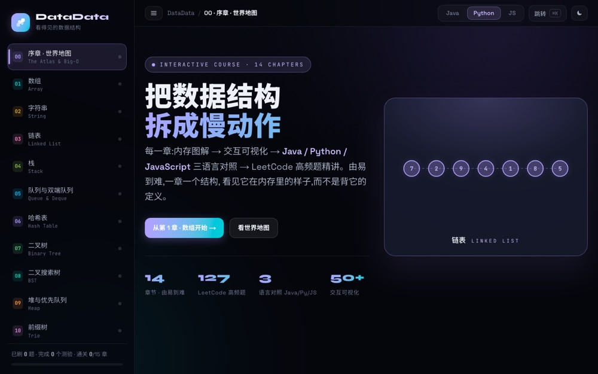
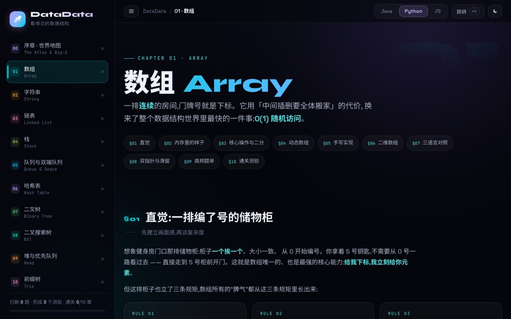

# DataData — See Inside Data Structures

**▶ [Open the course](https://data-data.vercel.app)** — runs in your browser, nothing to install.

An interactive data structures course for people starting from zero. Every structure is
shown as a memory diagram first, then animated step by step, then written out in three
languages side by side — because the hard part is rarely the syntax, it is not being able
to see what the machine is doing.

Sister sites: [AlgoAlgo](https://algo-algo.vercel.app) (algorithms) and
[APIer](https://apier-eta.vercel.app) (HTTP, REST and GraphQL).



*The course home — 14 chapters, three languages side by side*



*Inside a chapter: memory diagram, live visualization, and code*

## Chapters

| # | Chapter | What it covers |
|---|---|---|
| 00 | Prologue | Why structure matters · Big-O · the complexity cheat sheet |
| 01 | Array | Contiguous memory, the addressing formula, resizing, two pointers, sliding window |
| 02 | String | Immutability, the constant pool, encoding, concatenation costs, KMP |
| 03 | Linked list | References instead of adjacency, the dummy sentinel, fast/slow pointers |
| 04 | Stack | LIFO, the call stack, monotonic stacks |
| 05 | Queue | FIFO, circular buffers, deques, monotonic queues, BFS |
| 06 | Hash table | Hash functions, collisions, load factor, chaining vs. open addressing |
| 07 | Binary tree | Recursion, four traversals, top-down vs. bottom-up |
| 08 | BST | Ordering invariants, degeneration, AVL, red-black trees, B+ trees |
| 09 | Heap | Sift up/down, priority queues, top-K, two-heap median |
| 10 | Trie | Prefix trees, array vs. map children, autocomplete |
| 11 | Union-Find | Union by rank, path compression, the α(n) bound |
| 12 | Advanced | Composite structures — LRU, LFU, and friends |
| ✦ | Atlas | Signal-to-structure map: read a problem, pick the structure |

Each chapter follows the same rhythm: an intuition first, then an interactive
visualization, then code in Java / Python / JavaScript, then the common mistakes, then
a quiz. Progress is stored locally in the browser.

## Running locally

Requires Node 22 (an `.nvmrc` is included):

```bash
nvm use
npm install
npm run dev      # http://localhost:3000
```

Build with type checking: `npm run build`.

## Structure

Next.js 15 (App Router) + TypeScript + React 19, plain CSS. There are no API routes, so the whole site prerenders to static
pages.

Each chapter is one folder under `app/` holding its page, its visualizations (`viz.tsx`) and
its own stylesheet, paired with a data file under `lib/` for the problem sets.

Shared pieces: the frame-by-frame player in `lib/stepper.tsx`, the quiz component in
`lib/quiz.tsx`, progress tracking in `lib/progress.tsx`, and design tokens in
`app/globals.css`.

---

© 2026 Weiren Feng. All rights reserved. Published for reading and portfolio purposes; not
licensed for reuse, modification, or redistribution.
